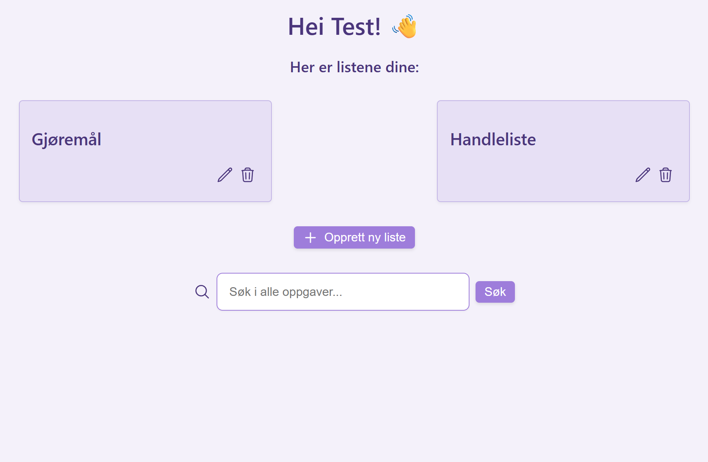
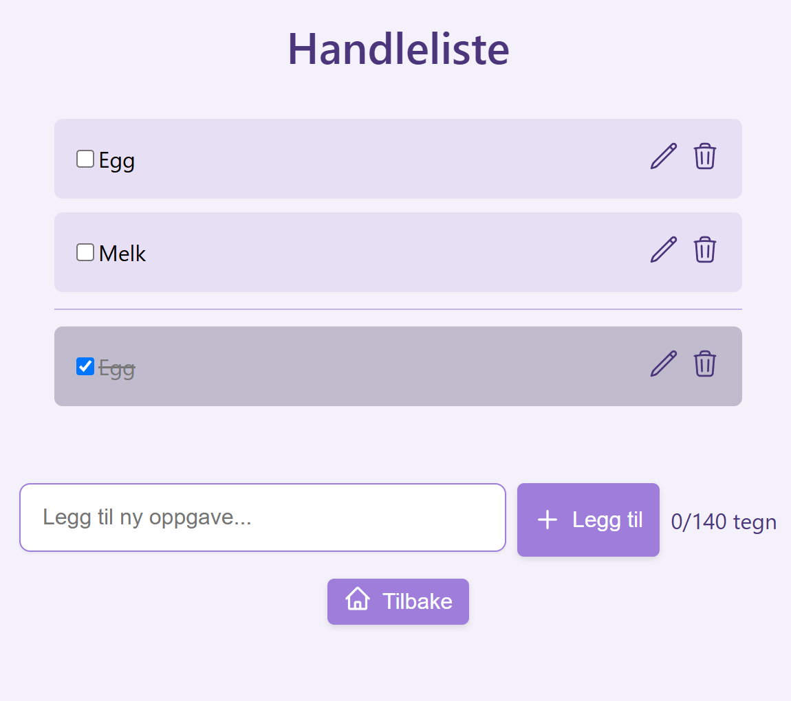

# TODO-app
### **Stine Bjordal**

En TODO-applikasjon bygget med [Next.js](https://nextjs.org/), [TypeScript](https://www.typescriptlang.org/) og [Prisma](https://www.prisma.io/) med [SQLite](https://www.sqlite.org/) som database.  


## Funksjonalitet

- Opprett nye lister  
- Se oversikt over eksisterende lister  
- Legg til oppgaver i en liste  
- Rediger oppgaver  
- Merk oppgaver som fullført  
- Slett oppgaver og lister 



## Teknologier brukt
- [Next.js](https://nextjs.org/) (App Router)  
- [React](https://react.dev/)  
- [TypeScript](https://www.typescriptlang.org/)  
- [Prisma](https://www.prisma.io/) (ORM)  
- [SQLite](https://www.sqlite.org/) (database)  
- [Zod](https://zod.dev/) (inputvalidering)  
- [Tailwind CSS](https://tailwindcss.com/) + egendefinerte klasser  
- [Heroicons](https://heroicons.com/) (ikoner)  
- [uuid](https://www.npmjs.com/package/uuid) for ID-generering
- [Vitest](https://vitest.dev/) for enhetstesting

## Komponenter
- `ListCard`: viser og lar deg redigere eller slette lister  
- `TaskList`: viser oppgaver med sortering på fullført/ikke fullført
- `TaskItem`: håndterer visning og interaksjon for én enkelt oppgave (avhuking, redigering og sletting)
- `CreateListForm` / `CreateTaskForm`: skjemaer for oppretting av lister og oppgaver  
- `ErrorBanner`: visning av feilmeldinger  
- `SearchBar`: søk i oppgaver på tvers av lister
- `AppButton`: En gjenbrukbar knapp-komponent med støtte for ikon og navigasjon

## Kjøre prosjektet
### 1. **Klon repoet:**
```bash 
git clone https://github.com/sbjordal/TODO-app
cd TODO-app
```
### 2. **Installer avhengigheter:**
```bash 
npm install
```
eller 
```bash 
pnpm install
```
### 3. **Konfigurer miljøvariabler:**
Kopier eksempelfilen: 
```bash 
cp .env.example .env
```  
### 4. **Opprett og migrer databasen**
```bash 
npx prisma migrate dev --name init
```
Dette vil opprette 'dev.db' og opprette alle tabellene i databasen i henhold til schema.prisma
### 5. **Generer Prisma Client**
```bash 
npx prisma generate
``` 
eller 
```bash 
pnpx prisma generate
``` 
Gjør at prosjektet kan kommunisere med databasen via Prisma
### 6. **Seed databasen med testdata**
```bash 
npx prisma db seed
```
### 7. **Kjør utviklingsserveren**: 
```bash 
npm run dev
``` 
eller 
```bash
pnpm run dev
``` 
Appen kjører nå på `http://localhost:3000`

### Kjøre tester:
```bash 
npx vitest 
```
Testprosessen er bare såvidt påbegynt, men det finnes 3 enhetstester.
## Antakelser og avgrensninger
- Prosjektet er utviklet for lokal kjøring ned SQLite-database
- Ingen autentisering eller tilgangskontroll; alle brukere deler samme data
- Enkel feil- og unntakshåndtering
- Ikke optimalisert for produksjon

Disse avgrensningene er gjort for å holde prosjektet enkelt og fokusert på funksjonaliteten i en TODO-app.

## Videre arbeid / forbedringer
- Legge til funksjonalitet for tidsfrister, tags og "favoritt"-markering av Tasks
- Mulighet for å legge til flere brukere, samt å velge bruker
- Skrive flere enhetstester og utvide testdekningen
- Bedre ytelse og optimalisering
- Legge til autentisering og adganskontroll
- Deploye prosjektet

## Lisens

MIT © 2025 Stine Bjordal